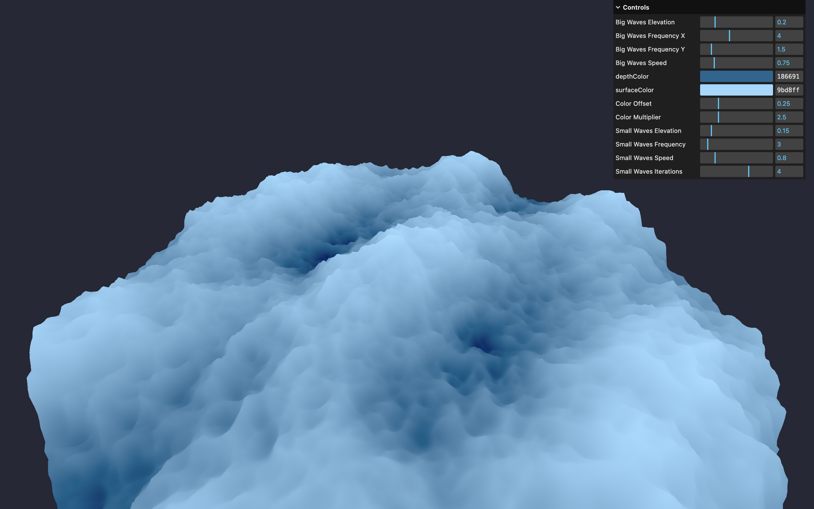

# 🌊 Three.js – Simulateur de mer agitée

Une scène 3D interactive représentant la surface d'une mer agitée, réalisée avec [Three.js](https://threejs.org/) et des shaders personnalisés. Projet inspiré du parcours Three.js Journey par Bruno Simon.



## 🚀 Démo

[Voir la démo](https://rekuiem84.github.io/raging-sea/)

## ✨ Fonctionnalités

- Surface d’eau animée avec des grandes et petites vagues (shader GLSL)
- Contrôle en temps réel des paramètres des vagues via une interface de debug
- Couleurs de profondeur et de surface ajustables
- Caméra libre (OrbitControls)
- Simulation réaliste des mouvements de l’eau, modélisés par des fonctions sinusoïdales enrichies d’un bruit de Perlin

## 🛠️ Installation & Lancement

1. **Cloner le dépôt :**

   ```bash
   git clone https://github.com/Rekuiem84/raging-sea
   cd raging-sea
   ```

2. **Installer les dépendances :**

   ```bash
   npm install
   ```

3. **Lancer le serveur de développement :**

   ```bash
   npm run dev
   ```

4. **Build pour la production :**

   ```bash
   npm run build
   ```

Les fichiers optimisés seront générés dans le dossier `dist/`.

## 📁 Structure du projet

```
├── src/           # Fichiers sources
│   └── shaders/
│       └── water/
│           ├── fragment.glsl
│           └── vertex.glsl
├── dist/          # Fichiers générés pour la production
├── package.json   # Dépendances et scripts
└── vite.config.js # Configuration Vite
```

## 🎛️ Paramètres ajustables (menu debug)

- Élévation, fréquence et vitesse des grandes vagues
- Élévation, fréquence, vitesse et nombre d'itérations des petites vagues
- Couleur de surface et de profondeur de l'eau
- Contrôle du calcul de la position des couleurs

## 🔗 Mes autres projets Three.js

- [Repo Three.js Journey principal](https://github.com/Rekuiem84/threejs-journey) — pour retrouver tous mes projets suivant ce parcours
